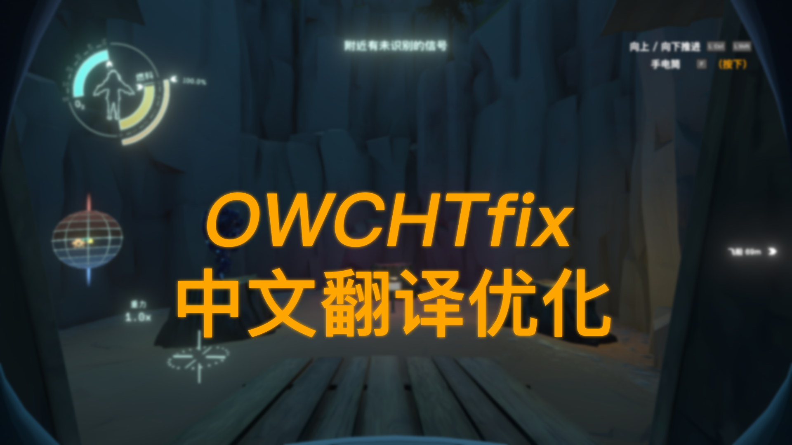

# OWCHTfix星际拓荒中文翻译优化
a (mostly) improved Chinese translation mod.
This mod is based on the library [Interplanetary Polyglot](https://github.com/xen-42/outer-wilds-localization-utility) from xen-42, with [Outer Wilds Chinese Fix](https://github.com/nice2cu1/OuterWildFixFont) from nice2cu1 for fixing the font display issues on ship.

一个个人翻译项目，目标是改善原版翻译质量，纠正不准确的表述以帮助玩家更准确地理解游戏信息。
本mod基于xen-42的通用翻译库[Interplanetary Polyglot](https://github.com/xen-42/outer-wilds-localization-utility)完成，并使用了nice2cu1的[Outer Wilds Chinese Fix](https://github.com/nice2cu1/OuterWildFixFont)以修正飞船仪表盘的字体显示异常。**在OWML内下载时请确认提示以下载这两个依赖。**

**游戏内语言设置选择ChineseFix以切换到mod翻译（安装后即默认为此语言）**

注：目前版本翻译了本体的所有文本，后续DLC完成后会再更一个小版本。

已知问题：  
由于翻译库的一个bug，有两条文本（不太重要）暂时无法正常显示翻译。  
由于GameOver字体没有被正确设置，导致死亡后文本不会显示且无法进入滚动名单，只能强制退出（某些情况下可能可以呼出暂停菜单）。   
(个人能力和时间有限，在翻译库作者修复bug前这些问题都暂时无法解决，抱歉::(
